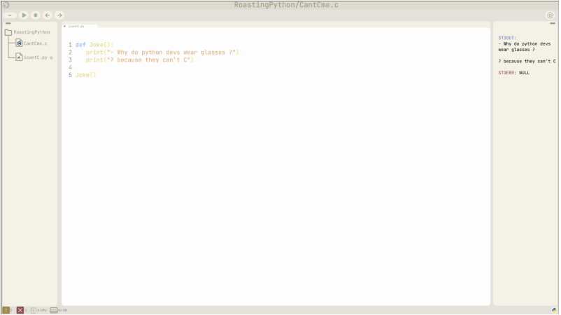

# ⚡ Online IDE with React Native & Vite 🚀


## 📝 Description

This project is an **online Integrated Development Environment (IDE)** built using **React Native** for the user interface and **Vite** as the development bundler. The IDE supports **code autocompletion** and **debugging** for **JavaScript**, **Python**, and **C** languages. It allows users to write code, receive suggestions, and run their code while viewing helpful debug messages in real-time! 🖥️✨

## 🔥 Features

- ✍️ **Code Autocompletion**: Autocomplete support for JavaScript, Python, and C.
- 🌐 **Multi-Language Support**: Execute and debug code in JavaScript, Python, and C.
- 🐞 **Debugging Console**: View debug messages and errors in a built-in console.
- ⚡ **Fast Development Environment**: Vite ensures fast compilation and hot module replacement (HMR) for a smooth coding experience.
- 📱 **Responsive UI**: React Native ensures the IDE is responsive across different platforms and devices.

## 🛠️ Technologies Used

- 📱 **React Native**: For creating a cross-platform user interface.
- 🚀 **Vite**: For fast and efficient bundling during development.
- ✨ **Monaco Editor**: To provide the code editor with autocompletion and syntax highlighting (like VS Code).
- 🎨 **Codemirror/Prism.js**: For language syntax highlighting and code execution.
- 🤖 **Language Servers**: To provide language-specific autocompletion and code analysis for JavaScript, Python, and C.

## 🚀 Setup and Installation

1. **Clone the repository**:
   ```bash
   git clone https://github.com/yanks88/awsomeIDE.git
   cd awsomeide/FRONT/PING_FRONT
   npm install
   npm run dev
